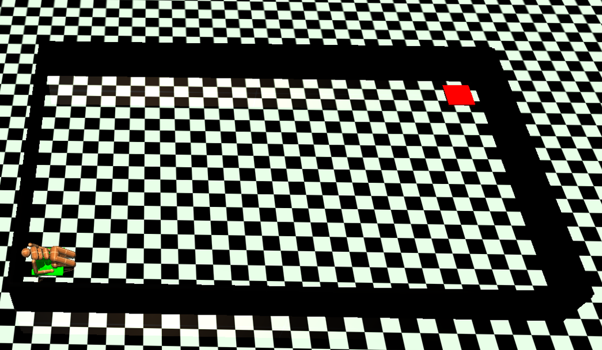

# RL2 Term Project — Walking Toward a Goal

강화학습을 활용해 휴머노이드 에이전트가 목표 지점까지 걸어가도록 학습시키는 프로젝트

## 프로젝트 개요

- MuJoCo 기반 커스텀 환경에서 휴머노이드 에이전트를 학습
- 가로 10m, 세로 6m 크기의 직사각형 맵 구성
- 시작 지점: (-1.5, -2) / 목표 지점: (7.5, 2.5)

## 🗂️ 폴더 구조
├── custom_envs/   # 커스텀 MuJoCo 환경 정의
├── final/         # 최종 학습 코드
├── img/           # 환경 이미지
└── README.md

##  환경 시각화



##  실행 방법

```bash
# 환경 확인
python final/viewer.py

# 학습 실행
python final/train.py
```

##  사용 기술

- Python
- MuJoCo
- Stable-Baselines3 / Custom RL
